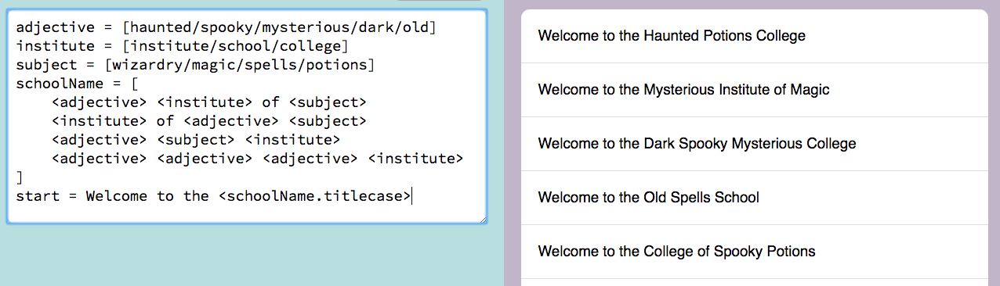

# Filigree

A language for generating text using text expansion rules, similar to [Tracery](https://github.com/galaxykate/tracery).  Use this to build bots or generate poetry!



## Try it

Write Filigree grammars in your browser with the [online editor](https://cinnamon-bun.github.io/filigree-website/).  Source code for that is [here](https://github.com/cinnamon-bun/filigree-website).

There's also an [example project you can clone on Glitch](https://glitch.com/~filigree-playground), which is nice because it remembers your grammars.
Source code for that is also [here on Github](https://github.com/cinnamon-bun/filigree-simple-website), and you can see its output page [here on Glitch](https://filigree-playground.glitch.me/).

## Table of contents

- [Simple input grammar](#simple-input-grammar)
- [Detailed input grammar](#detailed-input-grammar)
- [Install](#install)
- [Command-line use](#command-line-use)
- [Usage in Javascript](#usage-in-javascript)
- [Advanced use: Rule modifiers](#advanced-use-rule-modifiers)
  - [Built in modifiers](#built-in-modifiers)
  - [Adding your own custom modifiers](#adding-your-own-custom-modifiers)
- [Determinism](#determinism)
- [Developing](#developing)

## Simple input grammar

```python
# Use <ruleName> to reference another rule.
# Use [a/b/c] to randomly choose from multiple options.

tweet = <username>: [What a nice day!/I am hungry for a <snack>]
username = @<fruit>
snack = [
    <fruit>
    <fruit> pie
    <fruit> pudding
]
fruit = [apple/banana/cherry]
```

Generating the "tweet" rule gives outputs like this:

```
@apple: What a nice day!

@cherry: I am hungry for a banana pudding!

@cherry: I am hungry for a apple pudding!
```

## Detailed input grammar

```python
# A Filigree file is a list of text-expansion rules.
# Their order in the file does not matter.

# Define a rule.  The right side is like a string but without quote marks.
job = candlestick maker

# Quote marks have no special meaning; they're just part of your text
reply = "That's nice," he replied.

# Randomly choose one of several options with square brackets and "/"
name = Captain [Moss/Pebble/Twig]

# Reference another rule with angled brackets
greeting = Hello to <name> who is a <job>.

# To make things occur rarely, use empty choices.
# The more empty choices, the less often the other choices will appear.
greeting2 = Hi [there /]<name>.     # "there " happens 1/2 of the time
greeting3 = Hi [there ////]<name>.  # "there " happens 1/5 of the time

# Choices can contain nested choices and references
greeting4 = [Hi [there /]<name>/Hello], how are you today?

# Or, choices can be written across multiple lines instead of using "/" on a single line.
# You can't mix these; choose either "/" or multi-line.
# Multi-line choices ignore blank lines, which means you can't use them to
# make rare choices like [rare////].
# Indentation and whitespace around each line is ignored.
berries = [
    blueberry
    strawberry
    cherry
]
fruits = [
apple
banana
cherry
<berries>
]
slogan = Have a [
    snack
    bite
] today!   # multi-line choice inside a longer phrase

# This is not allowed -- the brackets have to be on their own lines:
#   foo = [bar
#      baz
#      quuz]

# Trailing whitespace on a line is removed.
# To make whitespace matter, put it inside choice brackets.
# You can also make a zero-length string this way.
threespaces = [   ]
wordAndSpace = [hello ]
nothing = []

# Rules can reference themselves but make sure it's possible for them to eventually stop!
# This returns "yo yo yo yo!" with a random number of repeats.
repeat = yo[ <repeat>/!]

a = b   # Comments start with "#" and can go on the same line as a rule.

    c = d  # Indentation is allowed and has no meaning

multiline = line1\nline2\nline3  # use "\n" to make a new line in the rule output

# Each rule declaration must be on its own line.  TODO: allow them to span lines
# Blank lines are ignored.
# The equals sign must have one space on each side.  TODO: fix this
# Rule names can contain letters, numbers, dashes, and underscores, but not spaces.  Capitalization matters.
# References can't contain anything nested inside the angle brackets, only plain old rule names
#   (no "<[cat/dog]Name>")
# If you see angle brackets in the output, it means you're referencing a rule that doesn't exist.
#   (like "Hello <thisRuleDoesNotExist>")
# If a rule name is defined more than once, the last one wins.
# Besides that, rules can be declared in any order.
# Set your text editor to make-file or Python language mode for approximate syntax highlighting.
```

## Install

To install the command-line tool:
```
npm install --global filigree-text
```

To use it in a specific javascript project:
```
npm install --save filigree-text
```

## Command-line use

```
filigree <filename> [-s|-r|-j|-g]

    Print out debugging info about a filigree file.
    With no options, prints a list of the rules in the file.
    -s, --source   print source
    -r, --repr     print source in repr mode (for debugging)
    -j, --json     print raw rule JSON
    -g, --graph    generate a graph of rules and their dependencies in mermaid format

filigree <filename> <ruleName> [-n|-s|-r|-j]

    Generate text from a rule in a filigree file.
    -n, --num      number of strings to generate.  (default: 1)
    --seed <s>     random seed for deterministic output

    If these options are provided, the specific rule is printed in detail
    instead of generating text.
    -s, --source   print source
    -r, --repr     print source in repr mode (for debugging)
    -j, --json     print raw rule JSON

Example:
filigree tweets.filigree             # see a list of the rules in the file
filigree tweets.filigree tweet -n 5  # generate text from the "tweet" rule 5 times
```

To see a graph of your rules and their dependencies, you'll need to install [mermaid.cli](https://github.com/mermaidjs/mermaid.cli).

```
npm install --global mermaid.cli  # installs "mmdc" mermaid graph renderer

filigree yourfile.filigree -g > graph.mmd
mmdc -i graph.mmd -o graph.png
```


The graph only shows rules, not individual pieces of rules.

## Usage in Javascript

Filigree is written in Typescript and comes with Typescript definitions.  It runs in the browser and in node.js.

```typescript
import Filigree from 'filigree-text';

let source = `
    name = [Joe|Sue]
    greeting = Hello <name>!
`;

// parse your filigree source
let seed = 'abc';
let fil = new Filigree(source, seed);  // seed is optional, omit it for different results every time
if (fil.err) {
    // if the source is has syntax errors, they will be shown here
    console.error(fil.error.message);
    process.exit(1)
}

// generate a string from the "greeting" rule
console.log(fil.generate('greeting');

// you can also supply a "wrapper" function to add markup around the results
// as the rules are put together.
let wrapperFn = (rule : string, text : string) : string =>
    `<div style="padding:10px; display:inline; border: 1px dotted red; border-radius:5px;">
        <sup>${rule}</sup>
        ${text}
    </div>`;
console.log(fil.generate('greeting', wrapperFn));

// you can reset the random seed to get the same result as before
fil.seed('abc');
console.log(fil.generate('greeting');
```

## Advanced use: Rule modifiers

Modifiers are small functions that change the string produced by a rule, for example to make it uppercase.

```python
greeting = hello
fruit = [apple/banana]
sentence = <greeting.titlecase> world, have some <fruit.s>!

# you can apply multiple modifiers in a row
loudSentence = <sentence.trim.uppercase>!!!
```

Modifiers can only be used inside a `<rule>` reference.

### Built in modifiers

```typescript
// grammar
s   // bat -> bats, box -> boxes
a   // box -> a box, apple -> an apple

// whitespace
trim         // " hello " -> "hello"   (remove leading and trailing spaces)
trimleft     // " hello " -> "hello "
trimright    // " hello " -> " hello"
mergespaces  // " a    b " -> " a b "  (combine consecutive spaces into a single space)

// case
uppercase    // exAMPLE INput -> EXAMPLE INPUT
lowercase    // exAMPLE INput -> example input
titlecase    // exAMPLE INput -> Example Input  (capitalize first letter of each word)
sentencecase // exAMPLE INput -> Example INput  (capitalize first character only)

// fun
inception  // hello -> H E L L O
wackycase  // hello world -> hElLo wOrLd
```

### Adding your own custom modifiers

```typescript
let fil = new Filigree(source);

// Add your own functions to the fil.modifiers object
// They should accept a string and return a string.
fil.modifiers.loud = (input : string) => {
    return input.toUpperCase() + '!!!!';
}
```

## Determinism

If there are any choices in you grammar (square brackets), there is an element of randomness.  Normally you will get different random outputs each time you call `generate`.

You can provide a random seed which will result in the same sequence of randomness every time.

If you omit the seed, you will get completely different results each time.

```typescript

// you can provide a seed when creating a Filigree, but in this case we don't.
let fil = new Filigree('start = [a/b/c/d]');
// different results every time you run this file
fil.generate('start');  // a
fil.generate('start');  // c
fil.generate('start');  // a

// set a seed to begin a repeatable sequence of randomness
fil.seed('whatever');
fil.generate('start');  // d
fil.generate('start');  // b
fil.generate('start');  // a

// set the seed again to obtain the same sequence again
fil.seed('whatever');
fil.generate('start');  // d
fil.generate('start');  // b
fil.generate('start');  // a
```

Any change to your Filigree rule source code will have a butterfly effect which results in new, different results for a certain seed.  In other words, the output is only repeatable if the Filigree rules stay the same.  Also each call to `generate` moves further into the sequence of random numbers, so for maximum repeatability you should set the seed just before every call to `generate`.

When making random choices, Filigree avoids choosing the same item twice in a row (either within a rule or across multiple calls to `generate`).  This works best if you don't reset the seed often, since that clears the memory of which items have been recently chosen.

## Developing

The parser is made using [Nearley](https://nearley.js.org/) and is specified in [filigreeGrammar.ne](src/filigreeGrammar.ne).

Running `npm run build` will do these steps:
1. Compile the Nearley parser using `nearleyc`, outputting `filigreeGrammar.ts`
1. Generate a railroad diagram of the syntax to `railroad.html`
1. Run `tsc` to compile all the typescript from `src/` into `dist/`

Compiling the parser only has to happen if the grammar itself changes.  Normally the parser is just used, not compiled, in day-to-day use.  Compiling has to happen on the command line but using the parser can happen in the browser.

Files and dependencies:


*(run `npm run depgraph` to update this image)*